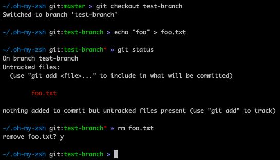

# gangly-zsh-theme
Minimalistic theme inspired by the af-magic theme for zsh.



## Installation
```sh
wget -xqO ~/.oh-my-zsh/custom/themes/gangly.zsh-theme https://raw.githubusercontent.com/blackmichael/gangly-zsh-theme/master/gangly.zsh-theme
```

Modify your `.zshrc` file to use `ZSH_THEME=gangly`
